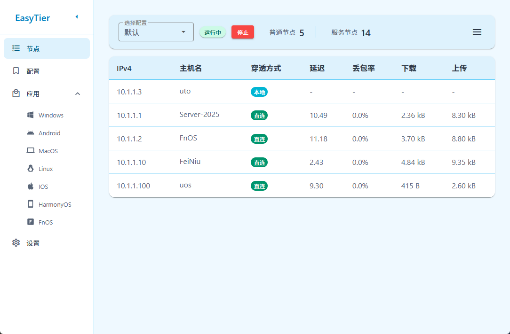
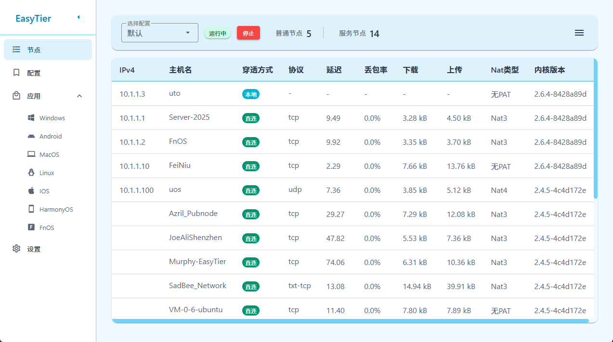
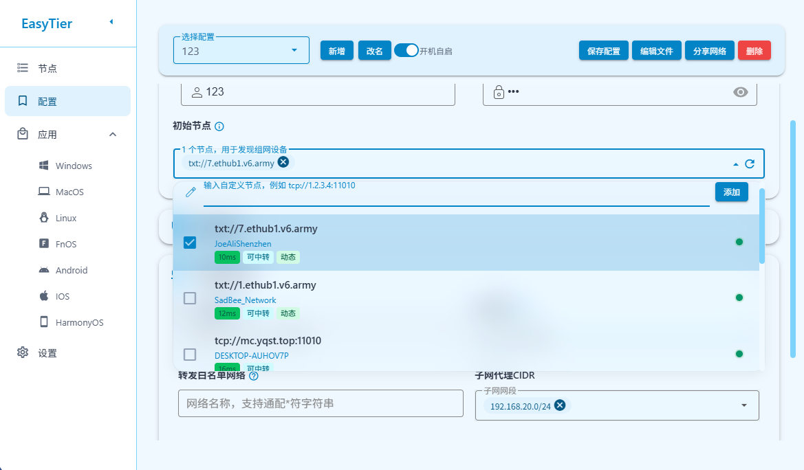
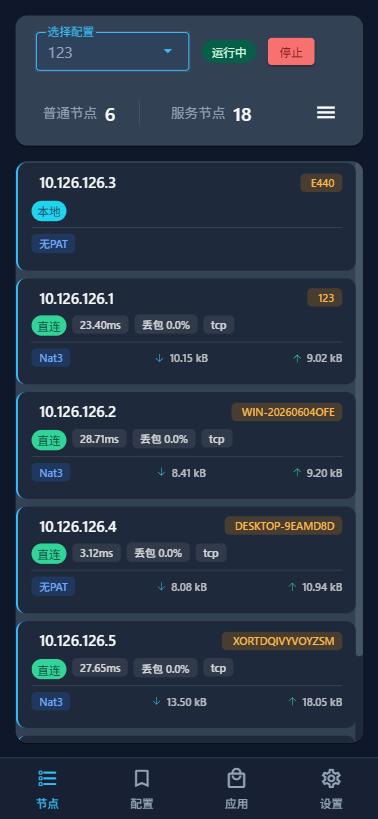
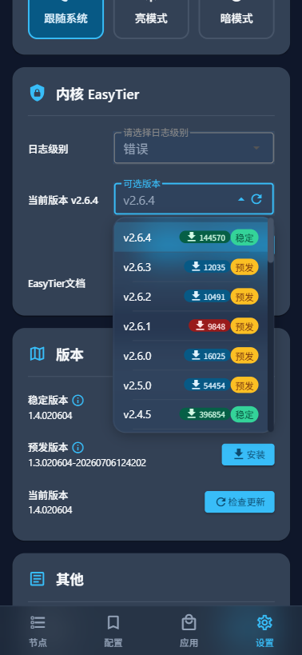

# EasyTier-EUI

## 简介

EasyTier简化使用的一种UI

适用于无公网IPv4场景

飞牛版本基于CGI模式实现，尽量减少内存使用

## 功能
- 支持多平台
  - FnOS (x86_64, aarch64)
  - Windows (x86_64)
  - Linux (x86_64, aarch64, riscv64, 部分验证)
  - MacOS (intel, arm64, 未验证)
- 支持多配置
- 支持设置开机自启
- 支持EasyTier常见设置项
- 提供动态初始节点（数据来自网络社区）
- 支持本地初始节点检测：可用性、延迟、可中转

## 界面
### PC端界面

 

 

 

### 移动端界面
    

## 其他链接
- <a href="https://github.com/EasyTier/EasyTier">EasyTier源码</a>
- <a href="https://easytier.cn">EasyTier文档</a>
- <a href="https://www.varletjs.com/#/zh-CN">Varlet文档</a>

## 打赏

  

